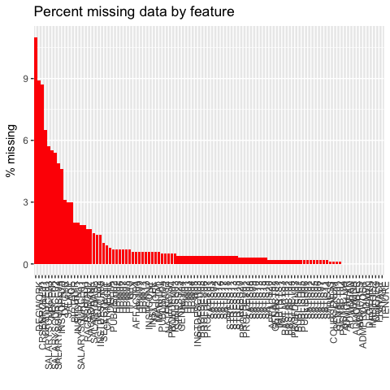
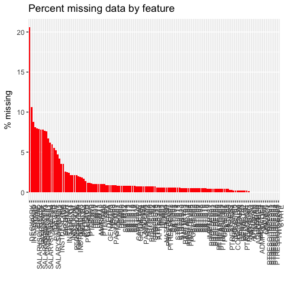
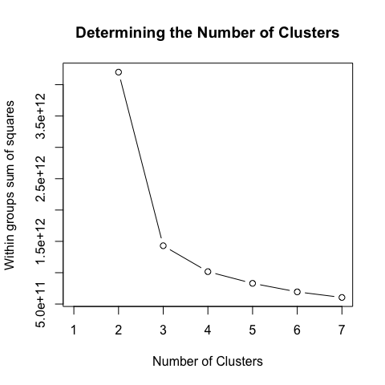
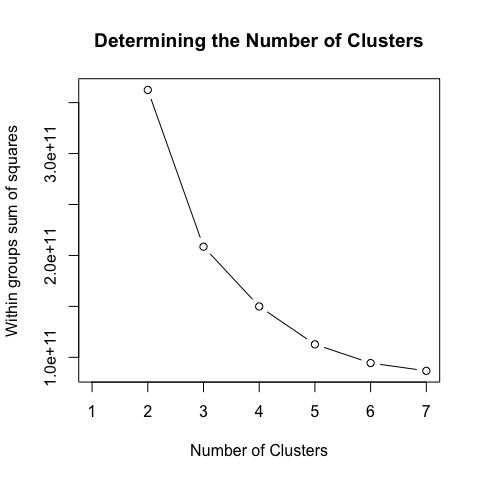

Faculty Classification
================
Chad Evans

Built with R version 3.3.2. Last run on 2017-11-07.

Contents
--------

-   [Configure](#configure)
    -   Directories
    -   Libraries
-   [Munge](#munge)
    -   Subset
    -   Missing Data
    -   Imputation
-   [Cluster Analysis of Full-time Faculty](#cluster-analysis-of-full-time-faculty)
    -   Determining the Number of Clusters
    -   K-means Clustering
    -   [Full-time Faculty Crosstabulations](#full-time-faculty-crosstabulations)
        -   Demography Table
        -   Institution Table
        -   Department Table
        -   Employment Table
    -   [Full-time Faculty Typology](#full-time-faculty-typology)
-   [Cluster Analysis of Part-time Faculty](#cluster-analysis-of-part-time-faculty)
    -   Determining the Number of Clusters
    -   K-means Clustering
    -   [Part-time Faculty Crosstabulations](#part-time-faculty-crosstabulations)
        -   Demography Table
        -   Institution Table
        -   Department Table
        -   General Employment Table
        -   Part-time Employment Table
    -   [Part-time Faculty Typology](#part-time-faculty-typology)
-   [Conclusion](#conclusion)
-   [Appendix](#appendix)
    -   Gappa and Leslie (1993) classification
    -   Furstenberg (2015) classification

Configure
---------

Munge
-----

``` r
load(file.path(Private_Cache,"HERI_Class.RData"))
source(file.path(Munge, "01_Merge_the_data.R"))
source(file.path(Munge, "02_Clean_the_data.R"))
source(file.path(Munge, "03_Recode_4_Impute.R")) # necessary to avoid subscript out of bounds
source(file.path(Munge, "HERI_vars.R"))
```

### Create Full-time and Part-time Datasets

First we create the dataframes that will be used for k-means clustering. There will be one dataframe for the Full-time faculty and one for the part-time faculty. For each of these data frames, we will remove administrative variables that contribute no meaningful classification data. We'll also remove the composite variables which simply summarize information on variables already contained in our dataset (although we keep STRESS because the data HERI gave us do not contain all the stress items in the full dataset). We also remove the variable indicating full-time status, as the two datasets correspond to that dimension. Finally, we remove all variables with high missingness (more than 25%). Missingness removed only a few variables from each of the datasets.

``` r
FTdf<-df %>% filter(FULLSTAT=="Yes") %>% select(-one_of(c(ADMINVARS, PTVARS,"PRODUCTIVITY","SATIS_WORKPLACE","SATIS_COMPENSATION","FULLSTAT","DEPT","DEPTDISC"))) # Get rid of admin vars, part-time only variables, and composite variables (b/c we have the items)  We are keeping STRESS because was lack signficant number of the STRESS items.  Also, DEPT and DEPTDISC have tons of levels and their are collapsed versions (e.g., DEPTA) already in the data.  Finally, all FT faculty are not on tenure track, but institution has tenure system.  So we must remove that variable as there is no variation.
miss_pct<-FTdf %>% map_dbl(function(x) { round((sum(is.na(x)) / length(x)) * 100, 1) })
HIGHMISS<-labels(which(miss_pct>25))
FTdf<-FTdf %>% select(-one_of(HIGHMISS)) # Get rid of additional features with large amounts of missing observations.
dim(FTdf)
```

    ## [1] 4527  108

``` r
PTdf<-df %>% filter(FULLSTAT=="No") %>% select(-one_of(c(ADMINVARS,"PRODUCTIVITY","SATIS_WORKPLACE","SATIS_COMPENSATION","FULLSTAT","DEPT","DEPTDISC"))) # %>% names() # Get rid of admin vars, and composite variables (b/c we have the items)  We are keeping STRESS because was lack signficant number of the STRESS items.
miss_pct<-PTdf %>% map_dbl(function(x) { round((sum(is.na(x)) / length(x)) * 100, 1) })
HIGHMISS<-labels(which(miss_pct>25))
PTdf<-PTdf %>% select(-one_of(HIGHMISS)) # Get rid of additional features with large amounts of missing observations.
dim(PTdf)
```

    ## [1] 4453  134

### Missing Data

``` r
miss_pct_plot(FTdf)
```



``` r
miss_pct_plot(PTdf)
```



### Imputation of Missing Values

As expected, listwise deletion across all features is impossible. We thus must consider a method to deal with the missingness. I opt for single imputiation. In some cases, like regression, it would probably be worth multiply imputing to get standard errors correct. However, this study is not using standard errors and is merely a procedure to find coherence in the data. I thus opt to singly impute the data for reasons of simplicity.

The mice() package allows for many different algorithms to impute data. I opted for using regression trees (CART). This was my choice because my data contain a large number of unbalanced factor variables. The stochasitc method of predictive mean matching (pmm) failed with a computationally singular error. The algorithm imputes each target column by using information from all of the other columns in the data. As most other columns have missingness as well, the algorthm uses the most recent round of imputations for each.

I set the maximum iterations to 5. This will give the chained equations multiple attempts to converge on a good imputed value for each cell.

``` r
#Imputing takes 2-3 hours
FTdfi<-FTdf %>% mice(m=1,maxit=5,seed=500, method='cart') %>% complete(1)
save(FTdfi, file=file.path(Private_Cache,"FTdfi.RData"))

PTdfi<-PTdf %>% mice(m=1,maxit=5,seed=500, method='cart') %>% complete(1)
save(PTdfi, file=file.path(Private_Cache,"PTdfi.RData"))
```

Cluster Analysis of Full-time Faculty
-------------------------------------

To implement k-means clustering, all data must be numeric. This requires converting binary factors to zero and ones. Multinomial variables needed to be converted into a matrix of dummy variables.

``` r
load(file.path(Private_Cache,"FTdfi.RData")) # Singly imputed data
idata<-data.frame(model.matrix(~ ., data=FTdfi, contrasts.arg = lapply(FTdfi[,sapply(FTdfi, is.factor)], contrasts, contrasts=FALSE)))
```

### Determining the number of Clusters

When implementing k-means clustering, one must specify the number of means to cluster around in the data. The most common approach to choosing the number of clusters is to plot how the within sum of squared residuals decreases as additional means are added and identify the "elbow." This is the point where the explained variation starts to begin to plateau off.

``` r
wssplot(idata, nc=7)
```



The elbow suggests that three clusters may be sufficient for explaining most of the variation in the full-time data. I therefore opt to go with three means in the k-means clustering analysis of full-time faculty.

### K-Means Clustering

``` r
n_clusters<-3
d<-idata %>% select(-X.Intercept.) %>% scale() %>% data.frame() # git rid of the intercept (no variation, convergence issues)
singular_d<-(colnames(d)[apply(d, 2, anyNA)])
d<-d %>% select(-one_of(singular_d))
kmeans.obj<- kmeans(d, n_clusters, nstart = 10, algorithm = c("Hartigan-Wong"))
FTdf$cluster<-kmeans.obj$cluster
```

Before conducting k-means clustering, all variables were normalized so that features with the greatest ranges did not have undue influence on the formation of clusters.

To conduct the k-means analysis, it is important to choose random starting points for the means. This helps prevent the algorithm (Hartingan-Wong 1979) from converging on suboptimal means. I used 10 different sets of starting points to identify the means that best summarize the information in the data.

### Full-time Faculty Crosstabulations

#### Demography Table

``` r
DemVars<-c("AGE","SEX","MARITAL2","RACEGROUP2","GENACT02","NATENGSP","NCHILD3","DEGEARN2","DEGWORK2")
table<-round(nfCrossTable(data=df[DemVars],CTvar=df$cluster),2)
colnames(table)<-Clusternames
rownames(table)<-c("Age","Male","Married","White","Citizen","Native English","Avg. Children","BA or Less","Prof Degree","Ph.D.","Working on a Degree")
kable(table, caption = "Distribution of Adjunct Clusters by Demographic Characteristics")
```

|                     |  Cluster 1 (n=656)|  Cluster 2 (n=1626)|  Cluster 3 (n=2245)|
|---------------------|------------------:|-------------------:|-------------------:|
| Age                 |              49.65|               45.99|               50.16|
| Male                |               0.49|                0.43|                0.43|
| Married             |               0.80|                0.75|                0.78|
| White               |               0.83|                0.81|                0.86|
| Citizen             |               0.93|                0.92|                0.95|
| Native English      |               0.88|                0.87|                0.91|
| Avg. Children       |               1.56|                1.27|                1.65|
| BA or Less          |               0.07|                0.04|                0.06|
| Prof Degree         |               0.54|                0.50|                0.64|
| Ph.D.               |               0.39|                0.46|                0.30|
| Working on a Degree |               0.13|                0.20|                0.19|

-   Most demographic characterstics don't differ much across clusters.
-   Cluster 3 tends to have a professional background (and somewhat fewer PhDs).
-   Cluster 1 are less likely to be working on a degree

#### Institution Table

``` r
INSTVARS<-c("INSTTYPE","INSTCONT","CARNEGIE","SELECTIVITY2","INSTDESCR03","INSTDESCR08","INSTOPN10","INSTOPN11")
table<-round(nfCrossTable(data=df[INSTVARS],CTvar=df$cluster),2)
colnames(table)<-Clusternames
rownames(table)<-c("2-year","4-year","University","Public","Research I","Research II","R3/Doctoral","Bachelors/Masters","Associates","Other Inst.","Highly Selective","Faculty very respectful","Administators very considerate","Research valued","Teaching valued")
kable(table, caption = "Distribution of Adjunct Clusters by Institutional Characteristics")
```

|                                |  Cluster 1 (n=656)|  Cluster 2 (n=1626)|  Cluster 3 (n=2245)|
|--------------------------------|------------------:|-------------------:|-------------------:|
| 2-year                         |               0.00|                0.00|                0.00|
| 4-year                         |               0.57|                0.58|                0.70|
| University                     |               0.43|                0.42|                0.30|
| Public                         |               0.33|                0.43|                0.36|
| Research I                     |               0.07|                0.04|                0.04|
| Research II                    |               0.26|                0.26|                0.16|
| R3/Doctoral                    |               0.09|                0.10|                0.08|
| Bachelors/Masters              |               0.56|                0.58|                0.70|
| Associates                     |               0.00|                0.00|                0.00|
| Other Inst.                    |               0.02|                0.02|                0.01|
| Highly Selective               |               0.10|                0.09|                0.11|
| Faculty very respectful        |               0.46|                0.31|                0.67|
| Administators very considerate |               0.30|                0.06|                0.31|
| Research valued                |               0.73|                0.48|                0.81|
| Teaching valued                |               0.85|                0.79|                0.98|

-   Cluster 3 have a much more optimistic outlook on their work. They are more likely to report that faculty and administrators are respectful, and that research and teaching is valued.
-   Cluster 2 are much more cynical. They report that faculty are not very respectful and administrators are nearly all not respectful. They also tend to report that research is not valued where they work. Also, teaching isn't particularly valued to them either.

#### Department Table

HERI has departamental level infromation, but it is challenging to see any patterns. So I collapsed the disciplines into the Biglan classification.

``` r
# DEPTA available, but tough to see any patterns with so many categories
source(file.path(Libraries, "Subclass.R"))
table<-round(prop.table(table(df$SUBCLASS, df$cluster),2),2)
colnames(table)<-Clusternames
#rownames(table)<-c("Agri/Forestry","Biology","Business","Education","Engineering","English","Fine Arts","Health-related","History/PoliSci","Humanities","Math/Stats","Non-technical","Technical","Physical Sciences","Social Sciences")
kable(table, caption = "Distribution of Adjunct Clusters by Departmental Characteristics")
```

|                 |  Cluster 1 (n=656)|  Cluster 2 (n=1626)|  Cluster 3 (n=2245)|
|-----------------|------------------:|-------------------:|-------------------:|
| Sciences        |               0.16|                0.19|                0.20|
| Soft/Applied    |               0.55|                0.28|                0.38|
| Humanities/Arts |               0.09|                0.30|                0.20|
| Health Sciences |               0.12|                0.10|                0.13|
| Social Sciences |               0.08|                0.13|                0.09|

-   Cluster 1 tends to be in Sciences or Soft/applied fields
-   Cluster 2 tends to have the most Humanities/Arts faculty.

#### Employment Table

``` r
WORKVARS<-c("PRINACT2","ACADRANK","GENACT01","HEALTHBENEFITS", "RETIREBENEFITS","SALARY","COURSENUM","PROFDEVFAC")
table<-round(nfCrossTable(data=df[WORKVARS],CTvar=df$cluster),2)
colnames(table)<-Clusternames
rownames(table)<-c("Teaching","Research","Administration/Other","Assistant Professor","Associate Professor","Instructor","Lecturer","Professor","Union member","Health benefits","Retirement","Avg. Salary","Avg. Courses","Prof. Dev. Rating")
kable(table, caption = "Distribution of Adjunct Clusters by Work Characteristics")
```

|                      |  Cluster 1 (n=656)|  Cluster 2 (n=1626)|  Cluster 3 (n=2245)|
|----------------------|------------------:|-------------------:|-------------------:|
| Teaching             |               0.06|                0.92|                0.93|
| Research             |               0.16|                0.02|                0.01|
| Administration/Other |               0.78|                0.06|                0.06|
| Assistant Professor  |               0.25|                0.35|                0.31|
| Associate Professor  |               0.19|                0.09|                0.10|
| Instructor           |               0.28|                0.25|                0.28|
| Lecturer             |               0.13|                0.28|                0.26|
| Professor            |               0.15|                0.03|                0.05|
| Union member         |               0.06|                0.16|                0.13|
| Health benefits      |               0.96|                0.96|                0.94|
| Retirement           |               0.97|                0.94|                0.94|
| Avg. Salary          |           77805.87|            55033.36|            56998.66|
| Avg. Courses         |               0.78|                3.27|                3.05|
| Prof. Dev. Rating    |               0.08|               -0.06|                0.02|

``` r
write.csv(table, file.path(Graphs,"FT_Employment_table.csv"))
```

-   Most salient differences found in employment
-   Cluster 1 do not teach. They are mostly administrators and some research faculty
-   The other clusters are teachers (so there are two types of full-time teachers)

### Full-time Faculty Typology

-   Cluster 1: Administrative/research adjuncts
-   Cluster 2: PhD adjunct
-   Cluster 3: Professions Adjunct

The "administrative adjunct" is the clearest pattern to emerge from the full-time faculty analysis. About 15% of full-time faculty fall into this class. The other two full-time adjuncts are best distinguished by their educational background (PhD versus Professional degree). Professional degree includes master's graduates, doctors, MBAs, etc. They are also distinguished by their perceived level of respect. PhD adjuncts (not a homogenous group) tend to perceive disrespect from collegues and administrators. They also feel their teaching and research are less valued.

Cluster Analysis of Part-time Faculty
-------------------------------------

``` r
load(file.path(Private_Cache,"PTdfi.RData")) # Singly imputed data
idata<-data.frame(model.matrix(~ ., data=PTdfi, contrasts.arg = lapply(PTdfi[,sapply(PTdfi, is.factor)], contrasts, contrasts=FALSE)))
```

### Determining the number of Clusters

``` r
wssplot(idata, nc=7) 
```



The elbow suggests that five clusters sufficiently explain most of the variation in the part-time data. I therefore opt to go with five means in the k-means clustering analysis for part-time faculty.

### K-Means Clustering

``` r
n_clusters<-5
d<-idata %>% select(-X.Intercept.) %>% scale() %>% data.frame() # git rid of the intercept (no variation, convergence issues)
singular_d<-(colnames(d)[apply(d, 2, anyNA)])
d<-d %>% select(-one_of(singular_d))
kmeans.obj<- kmeans(d, n_clusters, nstart = 10, algorithm = c("Hartigan-Wong"))
PTdf$cluster<-kmeans.obj$cluster
```

### Part-time Faculty Crosstabulations

#### Demography Table

``` r
DemVars<-c("AGE","SEX","MARITAL2","RACEGROUP2","GENACT02","NATENGSP","NCHILD3","DEGEARN2","DEGWORK2")
table<-round(nfCrossTable(data=df[DemVars],CTvar=df$cluster),2)
colnames(table)<-Clusternames
rownames(table)<-c("Age","Male","Married","White","Citizen","Native English","Avg. Children","BA or Less","Prof Degree","Ph.D.","Working on a Degree")
kable(table, caption = "Distribution of Adjunct Clusters by Demographic Characteristics")
```

|                     |  Cluster 1 (n=351)|  Cluster 2 (n=1240)|  Cluster 3 (n=756)|  Cluster 4 (n=1213)|  Cluster 5 (n=893)|
|---------------------|------------------:|-------------------:|------------------:|-------------------:|------------------:|
| Age                 |              61.45|               47.00|              48.16|               52.63|              53.68|
| Male                |               0.56|                0.39|               0.38|                0.59|               0.47|
| Married             |               0.82|                0.74|               0.74|                0.83|               0.81|
| White               |               0.90|                0.79|               0.80|                0.86|               0.85|
| Citizen             |               0.97|                0.93|               0.95|                0.98|               0.98|
| Native English      |               0.93|                0.87|               0.90|                0.95|               0.93|
| Avg. Children       |               1.92|                1.46|               1.36|                1.95|               1.98|
| BA or Less          |               0.04|                0.10|               0.05|                0.10|               0.14|
| Prof Degree         |               0.25|                0.68|               0.63|                0.78|               0.72|
| Ph.D.               |               0.71|                0.22|               0.33|                0.12|               0.14|
| Working on a Degree |               0.06|                0.26|               0.27|                0.18|               0.19|

-   Cluster 1 is distinctly older and have PhDs
-   The other clusters tend to have professional degrees, particularly cluster 4

#### Institution Table

``` r
INSTVARS<-c("INSTTYPE","INSTCONT","CARNEGIE","SELECTIVITY2","INSTDESCR03","INSTDESCR08","INSTOPN10","INSTOPN11")
table<-round(nfCrossTable(data=df[INSTVARS],CTvar=df$cluster),2)
colnames(table)<-Clusternames
rownames(table)<-c("2-year","4-year","University","Public","Research I","Research II","R3/Doctoral","Bachelors/Masters","Associates","Other Inst.","Highly Selective","Faculty very respectful","Administators very considerate","Research valued","Teaching valued")
kable(table, caption = "Distribution of Adjunct Clusters by Institutional Characteristics")
```

|                                |  Cluster 1 (n=351)|  Cluster 2 (n=1240)|  Cluster 3 (n=756)|  Cluster 4 (n=1213)|  Cluster 5 (n=893)|
|--------------------------------|------------------:|-------------------:|------------------:|-------------------:|------------------:|
| 2-year                         |               0.02|                0.05|               0.03|                0.05|               0.06|
| 4-year                         |               0.72|                0.71|               0.70|                0.69|               0.65|
| University                     |               0.26|                0.24|               0.27|                0.26|               0.29|
| Public                         |               0.39|                0.54|               0.48|                0.28|               0.36|
| Research I                     |               0.08|                0.05|               0.06|                0.03|               0.03|
| Research II                    |               0.12|                0.12|               0.14|                0.16|               0.17|
| R3/Doctoral                    |               0.04|                0.06|               0.05|                0.05|               0.07|
| Bachelors/Masters              |               0.73|                0.72|               0.72|                0.71|               0.67|
| Associates                     |               0.02|                0.05|               0.03|                0.04|               0.06|
| Other Inst.                    |               0.00|                0.00|               0.01|                0.00|               0.00|
| Highly Selective               |               0.17|                0.07|               0.05|                0.02|               0.04|
| Faculty very respectful        |               0.56|                0.56|               0.23|                0.51|               0.90|
| Administators very considerate |               0.26|                0.13|               0.03|                0.15|               0.53|
| Research valued                |               0.80|                0.70|               0.27|                0.56|               0.84|
| Teaching valued                |               0.94|                0.96|               0.64|                0.91|               1.00|

-   The faculty environment is important
    -   Cluster 3 are in adverse environments where teach and reseach are not valued and where faculty and administrators are not respectful
    -   Cluster 5 tend to have respectful administrators
-   Teaching is valued (except for cluster 3)
-   Research somewhat less valued for cluster 4
-   Cluster 1 in somewhat more selective of institutions

#### Department Table

``` r
source(file.path(Libraries, "Subclass.R"))
table<-round(prop.table(table(df$SUBCLASS, df$cluster),2),2) # DEPTA was aggregated by HERI
colnames(table)<-Clusternames
#rownames(table)<-c("Agri/Forestry","Biology","Business","Education","Engineering","English","Fine Arts","Health-related","History/PoliSci","Humanities","Math/Stats","Non-technical","Technical","Physical Sciences","Social Sciences")
kable(table, caption = "Distribution of Adjunct Clusters by Departmental Characteristics")
```

|                 |  Cluster 1 (n=351)|  Cluster 2 (n=1240)|  Cluster 3 (n=756)|  Cluster 4 (n=1213)|  Cluster 5 (n=893)|
|-----------------|------------------:|-------------------:|------------------:|-------------------:|------------------:|
| Sciences        |               0.22|                0.17|               0.11|                0.17|               0.12|
| Soft/Applied    |               0.26|                0.28|               0.29|                0.50|               0.49|
| Humanities/Arts |               0.25|                0.35|               0.40|                0.12|               0.18|
| Health Sciences |               0.08|                0.06|               0.03|                0.09|               0.08|
| Social Sciences |               0.19|                0.14|               0.17|                0.12|               0.14|

-   Cluster 3 tend to be found in the Arts and humanities
-   Clusters 4 and 5 tend to be found in soft, applied fields like education and business

#### Employment Table

``` r
WORKVARS<-c("PRINACT2","ACADRANK","GENACT01","HEALTHBENEFITS", "RETIREBENEFITS","PTSALARY","COURSENUM","PROFDEVFAC")
table<-round(nfCrossTable(data=df[WORKVARS],CTvar=df$cluster),2)
colnames(table)<-Clusternames
rownames(table)<-c("Teaching","Research","Administration/Other","Assistant Professor","Associate Professor","Instructor","Lecturer","Professor","Union member","Health benefits","Retirement","Avg. Salary","Avg. Courses","Prof. Dev. Rating")
kable(table, caption = "Distribution of Adjunct Clusters by Work Characteristics")
```

|                      |  Cluster 1 (n=351)|  Cluster 2 (n=1240)|  Cluster 3 (n=756)|  Cluster 4 (n=1213)|  Cluster 5 (n=893)|
|----------------------|------------------:|-------------------:|------------------:|-------------------:|------------------:|
| Teaching             |               0.82|                0.95|               0.98|                0.98|               0.98|
| Research             |               0.06|                0.01|               0.01|                0.00|               0.00|
| Administration/Other |               0.11|                0.03|               0.01|                0.02|               0.02|
| Assistant Professor  |               0.10|                0.10|               0.07|                0.06|               0.09|
| Associate Professor  |               0.18|                0.02|               0.03|                0.04|               0.06|
| Instructor           |               0.06|                0.44|               0.48|                0.68|               0.53|
| Lecturer             |               0.12|                0.41|               0.38|                0.16|               0.24|
| Professor            |               0.54|                0.03|               0.04|                0.06|               0.09|
| Union member         |               0.22|                0.31|               0.28|                0.10|               0.16|
| Health benefits      |               0.86|                0.71|               0.73|                0.18|               0.30|
| Retirement           |               0.91|                0.72|               0.75|                0.23|               0.35|
| Avg. Salary          |           36756.26|            18573.80|           16337.20|             8683.50|           13602.82|
| Avg. Courses         |               1.75|                2.79|               2.96|                1.63|               2.03|
| Prof. Dev. Rating    |               0.79|                0.01|              -0.06|               -0.17|              -0.04|

``` r
write.csv(table, file.path(Graphs,"PT_Employment_table_1.csv"))
```

-   All part-time faculty tend to be teachers, but cluster 1 also has some roles in research and administration
-   Cluster 1 tend to be part-time professors (not only lecturers/teachers)
-   Cluster 1, 2 and 3 tend to have full benefits. Cluster 4 and 5 tend to not have benefits
-   Cluster 1 tend to earn more

#### Part-time Employment Table

``` r
PTVARS<-c("PRINACT2","PTCHOICE","PTWORKFT","PTCAREER","PTTEACH","PTSALARY","PTPAY") # kept PRINACT2 bc bug requires it
table<-round(nfCrossTable(data=df[PTVARS],CTvar=df$cluster),2)
colnames(table)<-Clusternames
rownames(table)<-c("Teaching","Research","Administration/Other","Involuntary PT","Sought FT","Career Outside Academia","# Other Institutions","Total Salary","Payment Per Course")
kable(table, caption = "Distribution of Adjunct Clusters by Part-time Characteristics")
```

|                         |  Cluster 1 (n=351)|  Cluster 2 (n=1240)|  Cluster 3 (n=756)|  Cluster 4 (n=1213)|  Cluster 5 (n=893)|
|-------------------------|------------------:|-------------------:|------------------:|-------------------:|------------------:|
| Teaching                |               0.82|                0.95|               0.98|                0.98|               0.98|
| Research                |               0.06|                0.01|               0.01|                0.00|               0.00|
| Administration/Other    |               0.11|                0.03|               0.01|                0.02|               0.02|
| Involuntary PT          |               0.19|                0.74|               0.81|                0.45|               0.47|
| Sought FT               |               0.73|                0.55|               0.76|                0.30|               0.34|
| Career Outside Academia |               0.08|                0.20|               0.21|                0.69|               0.45|
| \# Other Institutions   |               0.21|                0.65|               0.88|                0.51|               0.45|
| Total Salary            |           36756.26|            18573.80|           16337.20|             8683.50|           13602.82|
| Payment Per Course      |            7604.80|             3713.26|            3316.54|             2964.21|            3487.01|

``` r
write.csv(table, file.path(Graphs,"PT_Employment_table_2.csv"))
```

-   Cluster 2 and Cluster 3 work PT Involuntarily. Cluster 1 work voluntarily.
-   Most in clusters 4 and 5 have not pursued full-time work unsuccessfully.
-   Cluster 4 are more likely to have full-time careers outside of academia
-   Cluster 2 and 3 most likely to be itinerants

### Part-time Faculty Typology

-   Cluster 1: Career Enders
-   Cluster 2: Aspiring Adjunct
-   Cluster 3: Itinerant Adjunct (often in humanities/arts with a PhD): often have pursued full-time labor and been denied
-   Cluster 4: Professional adjunct
-   Cluster 5: Voluntary adjunct (work expectations totally different). They feel respected by administrators/collegues, even though they don't have unions or benefits.

Part-time faculty tend to be teachers, even career-enders with small roles in research and administration. Cluster four may be only "one coursers" with a very limited role, often in the professional fields, and without any serious professional development or benefits.

Conclusion
----------

The employment characteristics tend to offer the most coherent understanding of who these adjuncts are and what they are doing in academia.

Appendix
--------

As demonstrated earlier, non-tenure track faculty are heterogeneous in their composition. Some are young academics trying to begin their careers in academia. Some are retiring faculty who are interested in leaving their life's work in a gradual fashion. We explored the motives for working part-time in academia and indeed it was a useful way to characterize and classify non-tenure track faculty. We also explored two other classification schema in our research. The first was designed by Gappa and Leslie and featured in their 1993 book "The Invisible Faculty." Gappa and Leslie were some of the earlist scholars to identify and seek knowledge about the growing numbers of part-time faculty in higher education. Examining faculty at 18 colleges and universities, they focused on the features of career-enders; experts; freelancers; and aspiring academics. Career enders consisted of faculty who were in the process of retiring from the workforce. Many of these individuals were not career academics, but instead had worked in the private sector. Part-time faculty in this class worked for supplemental income or simply because they enjoyed teaching. Experts (specialists or professionals) were hired for their specialized knowledge or experience. Freelancers were mostly faculty who wanted to supplement the income earned from a career outside of academia. These faculty were also commonly homemakers, taking care of children and domestic chores on the side.

A final category identified by these authors were the aspiring academics. Aspiring academics are “relatively new Ph.D.’s seeking tenure-track appointments and some Ph.D. recipients who have been teaching on a part-time basis for years in the hope of attaining a full-time, tenure-track position. Under better circumstances, they would be part of the tenured faculty (1993, p.54.55).” This definition calls attention to an important dimension often excluded by many researchers. Rather than generalize across all adjuncts, Gappa and Leslie make the point of distinguishing between those who are trying to establish a full-time, long-term career in academia and those who simply dabble in it. Recognizing the voluntary/involuntary nature of contingent status, then, is integral for any typological schema. This is a point also stressed by other researchers (Tilly 1998, Maynard and Joseph 2008).

While the IPEDS and SDR datasets were very useful in understanding the growth of non-tenure track faculty over the decades, they each possess limitations. For the follow section, we draw on the HERI Faculty Survey. HERI is a cross-sectional instrument generalizing to all postsecondary instructional faculty. We draw specifically on their component related to non-tenure track faculty. The information on these faculty, particularly the part-time, non-tenure track faculty, is far more detailed than IPEDS or SDR. In the following figure (Figure 27), we take advantage of this detail by reproducing the classifcation schema formalized by Leslie and Gappa (1993).

``` r
load(file.path(Private_Cache,"HERI_Class.RData"))
source(file.path(Munge, "01_Merge_the_data.R"))
source(file.path(Munge, "02_Clean_the_data.R"))
#source(file.path(Munge, "03_Recode_4_Impute.R"))
source(file.path(Munge, "HERI_vars.R"))
source(file.path(Munge, "03_Recode_HERI.R"))
```

``` r
ggplot(data=subset(df, !is.na(GAPPANTT)), aes(x=GAPPANTT)) + geom_bar(fill="firebrick") + xlab("Adjunct Type") + ylab("Count") +
labs(title="Gappa and Leslie Classification of Adjunct Faculty (1993)", subtitle= "Schema Applied to HERI Faculty Survey 2010") +
labs(caption = "Evans & Furstenberg. HERI Faculty Survey 2010") + theme(axis.text=element_text(size=10), axis.title=element_text(size=10), legend.text=element_text(size=10), legend.title=element_text(size=10))
```


As shown above, half of the data we were supplied by HERI pertain to full-time, non-tenure track faculty. Aspiring academics are the largest subgroup of part-time faculty. In fact, there are more part-time aspiring academics in the sample than all other part-time adjuncts put together. Experts and freelancers each constitute about 10% of the non-tenure track population. Career-enders constitute a small minority of 4%.

Dr. Furstenberg developed a second classification system that splits adjuncts into four categories, rather than five. In his framework, adjunct classification takes on two dimensions: whether the faculty member worked full-time or part-time, and whether the adjunct held work in addition to his or her adjunct position. Professional adjuncts were part-time faculty who held full-time careers outside of education. Itinerants were faculty members teaching piecemeal at two or more institutions. Some have referred to these individuals as "freedom flyers" as they tend to spend a considerable amount of time commuting between jobs. Single institution adjuncts, however, only hold one part-time position and no other career (inside or outside of academia). They are therefore employed by a single institution. His last category is the full-time, non-tenure track group of faculty members. When applying Furstenberg's schema, it divides the sample of part-time faculty members into equitably sized groups, each containing between 13% and 19% of the sample.

``` r
ggplot(data=subset(df, !is.na(ADJUNCT1)), aes(x=ADJUNCT1)) + geom_bar(fill="steelblue4") + xlab("Adjunct Type") + ylab("Count") +
labs(title="Furstenberg Classification of Adjunct Faculty (2015)") +
labs(caption = "Evans & Furstenberg. HERI Faculty Survey 2010") + theme(axis.text=element_text(size=10), axis.title=element_text(size=10), legend.text=element_text(size=10), legend.title=element_text(size=10))
```


Now we turn our attention to how adjunct classification compares across demographics, employment conditions and job activities. We rely on the Gappa and Leslie categorization here due to its prevalence in the literature. HERI allowed us to distinguish all five categories of adjuncts, derived from questions related to full-time/part-time status, (in)voluntary status, outside career status and whether retirement is imminent (with three years).

### Demographic Characteristics of Gappa Classification

``` r
GAPPAnames<-c("Full-time","Aspiring Academic","Career-Ender","Expert","Freelancer")
DemVars<-c("AGE","SEX","MARITAL2","RACEGROUP2","GENACT02","NATENGSP","NCHILD3","DEGEARN2","DEGWORK2")
table<-round(as.data.frame(nfCrossTable(data=df[DemVars],CTvar=as.integer(df$GAPPANTT))),2)
colnames(table)<-GAPPAnames
rownames(table)<-c("Age","Male","Married","White","Citizen","Native English","Avg. Children","BA or Less","Prof Degree","Ph.D.","Working on a Degree")
kable(table, caption = "Distribution of Adjunct Clusters by Demographic Characteristics")
```

|                     |  Full-time|  Aspiring Academic|  Career-Ender|  Expert|  Freelancer|
|---------------------|----------:|------------------:|-------------:|-------:|-----------:|
| Age                 |      48.59|              48.47|         65.64|   52.64|       52.36|
| Male                |       0.44|               0.47|          0.52|    0.60|        0.34|
| Married             |       0.77|               0.75|          0.80|    0.84|        0.83|
| White               |       0.84|               0.79|          0.92|    0.87|        0.90|
| Citizen             |       0.94|               0.95|          1.00|    0.97|        0.96|
| Native English      |       0.89|               0.89|          0.95|    0.96|        0.93|
| Avg. Children       |       1.50|               1.60|          2.07|    1.87|        1.79|
| BA or Less          |       0.05|               0.08|          0.05|    0.16|        0.08|
| Prof Degree         |       0.58|               0.69|          0.53|    0.70|        0.65|
| Ph.D.               |       0.37|               0.23|          0.42|    0.14|        0.28|
| Working on a Degree |       0.19|               0.27|          0.07|    0.13|        0.13|

In terms of demographic characteristics, full-time non-tenure track faculty tend to be married with children. Three-quarters are married and two-thirds of them have at least one child. They come from various segments of the age distribution, with sizeable numbers (39%) mid-career (age 40-55) and are evenly split between men and women. Half tend to have earned a Ph.D. and half are at the Master's level. There are also a few (5%) who have only earned a bachelor's (or lower).

Aspiring academics tend to closely resemble full-time, non-tenure track faculty. The only difference is that aspiring academics have been unable to obtain a full-time position in academia. Aspiring academics also are slightly less likely to have earned a Ph.D., which is probably closely related to why they have been unable to find full-time work in a single institution.

Career-enders are predictably older, with 96% of them 55 or older. They are overwelmingly white, which is an artifact of the time period when many of them were hired. However, the gender composition is evenly split. They also are more likely to have children, which again is related to the fact that they are older and have had more time to begin families. Aside from these features, career-enders are otherwise very similar to full-time adjuncts and aspiring academics.

Experts in academia tend to be white men (60% are men). They also tend to be older and are less likely to have earned a Ph.D.. Many of these characteristics make sense for an expert. They are older, having spent many years outside of academia gaining practical experience valuable to students. They are hired for this expertise, not for their educational credentials, per se.

Finally, freelancers are very similar to experts on most demographic characteristics. The one important exception is related to gender. Freelancers are much more likely to be female. Perhaps women pursue freelancing academic careers in order to be more available to their families. However, our analysis finds that freelancers are no more likely to have children than experts. Nonetheless, traditional gender roles likely have a role in determining why women become freelancers and men become adjunct experts.

### Institutional Characteristics of Gappa Classification

``` r
INSTVARS<-c("INSTTYPE","INSTCONT","CARNEGIE","SELECTIVITY2","INSTDESCR03","INSTDESCR08","INSTOPN10","INSTOPN11")
table<-round(nfCrossTable(data=df[INSTVARS],CTvar=as.integer(df$GAPPANTT)),2)
colnames(table)<-GAPPAnames
rownames(table)<-c("2-year","4-year","University","Public","Research I","Research II","R3/Doctoral","Bachelors/Masters","Associates","Other Inst.","Highly Selective","Faculty very respectful","Administators very considerate","Research valued","Teaching valued")
kable(table, caption = "Distribution of Adjunct Clusters by Institutional Characteristics")
```

|                                |  Full-time|  Aspiring Academic|  Career-Ender|  Expert|  Freelancer|
|--------------------------------|----------:|------------------:|-------------:|-------:|-----------:|
| 2-year                         |       0.00|               0.04|          0.05|    0.04|        0.05|
| 4-year                         |       0.64|               0.69|          0.70|    0.68|        0.70|
| University                     |       0.36|               0.26|          0.24|    0.28|        0.26|
| Public                         |       0.38|               0.44|          0.44|    0.33|        0.40|
| Research I                     |       0.05|               0.04|          0.06|    0.04|        0.04|
| Research II                    |       0.21|               0.14|          0.10|    0.19|        0.14|
| R3/Doctoral                    |       0.09|               0.06|          0.06|    0.04|        0.06|
| Bachelors/Masters              |       0.64|               0.71|          0.72|    0.69|        0.71|
| Associates                     |       0.00|               0.04|          0.05|    0.04|        0.04|
| Other Inst.                    |       0.01|               0.00|          0.00|    0.00|        0.00|
| Highly Selective               |       0.14|               0.05|          0.09|    0.04|        0.07|
| Faculty very respectful        |       0.51|               0.55|          0.61|    0.58|        0.53|
| Administators very considerate |       0.22|               0.20|          0.23|    0.22|        0.23|
| Research valued                |       0.68|               0.61|          0.64|    0.64|        0.65|
| Teaching valued                |       0.89|               0.89|          0.94|    0.90|        0.91|

There are also differences in the actual work activities of adjuncts. While all adjuncts in the HERI sample are instructors in some capacity, full-time adjuncts are more likely than the other classes of adjuncts to have principle job responsibilities in other areas like administration and research. Full-time adjuncts are hired in all academic fields (Biglan classification), however, they are less likely to be found in the hard/pure sciences. They do work regularly in the hard/applied fields, however, like medicine and nursing. Nearly all full-time adjuncts have professional development opportunities available to them and, furthermore, the majority partipate in professional development on a regular basis. This behavior ties in to what we know about full-time employees. Employers make a greater effort to develop the staff they see as full-time and fully committed. Full-time adjuncts tend to have considerable teaching obligations. They teach nearly three courses on average and also tend to have larger classes than other adjunct types.

Regarding aspiring adjuncts, their principle activity in the vast majority of cases is teaching. Aspiring academics are found in all Biglan academic fields (although rarely in hard/pure sciences). Professional development is less likely part of an aspiring academic's work experiences. Many (20%) do not have opportunities for professional development and only a third ever participate in workplace trainings. Their teaching load resembles that of full-time adjuncts, despite the fact that they only work part-time. This high teaching load, no doubt, is part of the reason aspiring academics have difficulty securing full-time work. They teach almost as much as their full-time, non-tenure track collegues, often hold outside careers, and must prepare applications and interview for work. This is a sizeable amount of responsibly for someone only working part-time in academia.

Career-enders also tend to be teachers, although some have principle responsibilities in administration. Professional development opportunities tend to be available for career-enders and a small majority of this group of adjuncts actually takes part in training opportunities. Among part-time adjunct types, career-enders are the most likely to participate in professional development, perhaps because they are accomstomed to these kinds of trainings from the earlier part of their careers. Career-enders teach fewer classes on average (1.8 classes).

Similar to aspiring academics, the principle job activity of experts is to teach. Their teaching, however, tends to mainly be in the hard/applied sciences. So clinical faculty and those working in medicine are often adjunct experts. Professional development is widely available for experts, but they are less likely to actually participate in these trainings. This may be related to the fact that they are "experts" and additional training may not be useful or valuable to them. Experts teach 1.5 classes on average, with slightly smaller class sizes. This may be related to the applied nature of some of the courses they teach. There may be more hands-on activities requiring smaller class sizes for these adjuncts.

Freelancers resemble aspiring academics with regared to work activities, without quite as demanding of circumstances. The majority of them have principle teaching activities and they teach in the same fields as aspriring adjuncts. Professional development is generally avaialble and many are participants in these trainings. At 2.2 courses, their workload is slightly lighter than that of aspiring academics.

### Academic Departments of Gappa Classification

``` r
table<-round(prop.table(table(df$DEPTA, df$GAPPANTT),2),2) # DEPTA was aggregated by HERI
colnames(table)<-GAPPAnames
rownames(table)<-c("Agri/Forestry","Biology","Business","Education","Engineering","English","Fine Arts","Health-related","History/PoliSci","Humanities","Math/Stats","Non-technical","Technical","Physical Sciences","Social Sciences")
kable(table, caption = "Distribution of Adjunct Clusters by Departmental Characteristics")
```

|                   |  Full-time|  Aspiring Academic|  Career-Ender|  Expert|  Freelancer|
|-------------------|----------:|------------------:|-------------:|-------:|-----------:|
| Agri/Forestry     |       0.01|               0.00|          0.00|    0.00|        0.00|
| Biology           |       0.05|               0.03|          0.03|    0.02|        0.05|
| Business          |       0.08|               0.13|          0.06|    0.21|        0.06|
| Education         |       0.10|               0.10|          0.18|    0.08|        0.17|
| Engineering       |       0.02|               0.02|          0.02|    0.03|        0.01|
| English           |       0.07|               0.09|          0.12|    0.03|        0.13|
| Fine Arts         |       0.06|               0.12|          0.06|    0.08|        0.07|
| Health-related    |       0.12|               0.05|          0.06|    0.12|        0.07|
| History/PoliSci   |       0.02|               0.04|          0.07|    0.01|        0.04|
| Humanities        |       0.09|               0.08|          0.06|    0.04|        0.07|
| Math/Stats        |       0.05|               0.04|          0.07|    0.03|        0.07|
| Non-technical     |       0.19|               0.15|          0.11|    0.17|        0.11|
| Technical         |       0.03|               0.03|          0.02|    0.05|        0.02|
| Physical Sciences |       0.04|               0.02|          0.03|    0.02|        0.04|
| Social Sciences   |       0.08|               0.12|          0.10|    0.11|        0.08|

### Employment Conditions of Gappa Classification

``` r
df$SALARYALL=pmax(df$SALARY, df$PTSALARY, na.rm = TRUE) # important to include the combined salary variable so that salary insn't exclude from the clustering.
WORKVARS<-c("PRINACT2","FULLSTAT","ACADRANK","GENACT01","HEALTHBENEFITS", "RETIREBENEFITS","SALARYALL","COURSENUM","PROFDEVFAC")
table<-round(nfCrossTable(data=df[WORKVARS],CTvar=as.integer(df$GAPPANTT)),2)
colnames(table)<-GAPPAnames
rownames(table)<-c("Teaching","Research","Administration/Other","Full-time","Assistant Professor","Associate Professor","Instructor","Lecturer","Professor","Union member","Health benefits","Retirement","Avg. Salary","Avg. Courses","Prof. Dev. Rating")
kable(table, caption = "Distribution of Adjunct Clusters by Work Characteristics")
```

|                      |  Full-time|  Aspiring Academic|  Career-Ender|    Expert|  Freelancer|
|----------------------|----------:|------------------:|-------------:|---------:|-----------:|
| Teaching             |       0.80|               0.97|          0.92|      0.98|        0.93|
| Research             |       0.04|               0.01|          0.02|      0.01|        0.01|
| Administration/Other |       0.17|               0.02|          0.06|      0.02|        0.06|
| Full-time            |       1.00|               0.00|          0.00|      0.00|        0.00|
| Assistant Professor  |       0.32|               0.08|          0.05|      0.07|        0.10|
| Associate Professor  |       0.11|               0.04|          0.06|      0.05|        0.07|
| Instructor           |       0.27|               0.51|          0.31|      0.59|        0.47|
| Lecturer             |       0.25|               0.32|          0.21|      0.23|        0.24|
| Professor            |       0.06|               0.06|          0.37|      0.06|        0.13|
| Union member         |       0.13|               0.23|          0.25|      0.10|        0.26|
| Health benefits      |       0.95|               0.54|          0.59|      0.31|        0.52|
| Retirement           |       0.94|               0.56|          0.65|      0.34|        0.59|
| Avg. Salary          |   59270.56|           15868.56|      23485.43|  10302.64|    18674.39|
| Avg. Courses         |       2.80|               2.59|          1.85|      1.50|        2.21|
| Prof. Dev. Rating    |       0.23|              -0.27|          0.10|     -0.38|       -0.11|

In terms of employment conditions, different types of adjunct face different types of conditions. As one would expect, full-time, non-tenure track faculty tend to have little or no work outside of their principle job. This makes sense, as they are already dedicating 35 hours or more to their principle job. As they are full-time workers, they also tend to have much stronger institutional support in terms of salary and perquisites. They earn good salaries (60,000/yr) and the vast majority have health insurance and retirement contributions. Perhaps because of this support, few of them have organized as members of labor unions.

Nearly half of aspriring academics have some or a lot of work outside of their principle academic position. Many of these aspiring academics, no doubt, are the itinerants or freeway fliers trying to piece together a career and work towards a full-time position. Half of them receive retirment benefits and half have employer contributions to their healthcare. Only a quarter have union membership. Their institutional salary is low ($16,000), which is probably why so many of them have second or even third jobs. Their family income is more robust ($70,000), suggesting that these individuals may have spouses taking on considerable responsibilities for family finances.

Career-enders tend to have similar job conditions as aspiring academics, only they are less likely to have jobs outside of their academic appointment. Their salary also tends to be higher, perhaps because they are older, have more job connections and more experience. They are also more likely to have health and retirement benefits. Maintaining health and retirement benefits is probably an important part of why career-enders like to stay active in academia before completely retiring. In all other ways, their work conditions seem closely related to what aspiring academics expereince.

Three-quarters of experts work substantial hours outside of their academic appointment. They are also less likely to have healthcare contributions, retirement benefits and union representation. Perhaps many of them already have health and retirement benefits from outside careers. Their institutional salary is also pretty low, but their overall income is by far the highest of all adjunct types. This all conforms with our expectations regarding experts. These individuals do not participate in academia for financial reasons. They probably do it simply because they like sharing their work experience with young people, being exposed to a stimulating, intellectual environment or they need a productive break from their full-time careers.

Finally, Freelancers are nearly identical to aspiring academics, except that they are much less likely to have substantial work outside of their principle academic appointment. Freelancers teach part-time proabably because they enjoy teaching, but do not necessarily want to do it full-time. A part-time job probably gives them great flexibility to meet family demands or other responsibilities.
