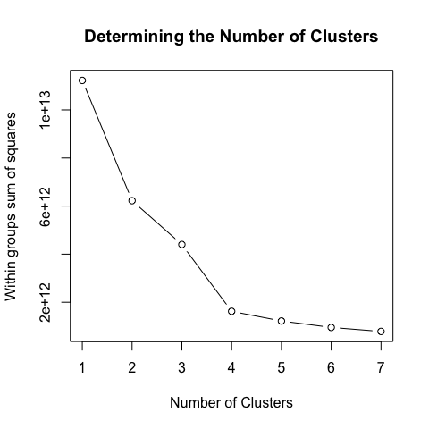

Faculty Classification
================
Chad Evans

Built with R version 3.3.2. Last run on 2017-08-28.

-   [Configure](#configure)
    -   Directories
    -   Libraries
-   [Munge](#munge)
-   [Exploratory Analysis](#exploratory-analysis)
    -   Missing Data
    -   Imputation
-   [Cluster Analysis](#cluster-analysis)
    -   K-means Clustering Algorithm
-   [Tabulations](#tabulations)

Configure
---------

Munge
-----

``` r
load(file.path(Private_Cache,"HERI_Class.RData"))
source(file.path(Munge, "01_Merge_the_data.R"))
source(file.path(Munge, "02_Clean_the_data.R"))
df<-as_data_frame(df)
```

``` r
SVYVARS<-c("ACE","SUBJID","YEAR","ACERECODE","RESTYPE")
INSTVARS<-c("DEPTA","INSTTYPE","INSTCONT","SELECTIVITY","CARNEGIE")
DEMGVARS<-c("GENACT03","GENACT04","NCHILD1","NCHILD2","MARITAL","SEX","NATENGSP","RACEGROUP","MAJORA","AGE")
PTVARS<-c("PTCHOICE","PTWORKFT","PTTSEEK","PTCAREER","PTREASON01","PTREASON02","PTREASON03","PTREASON04","PTREASON05","PTREASON06","PTREASON07","PTRESOURCES01","PTRESOURCES02","PTRESOURCES03","PTRESOURCES04","PTRESOURCES05","PTOPN01","PTOPN02","PTOPN03","PTOPN04","PTOPN05","PTOPN06","PTOPN07","PTOPN08","PTOPN09","PTOPN10","PTTEACH","PTSALARY","PTPAY")
OTHERS<-c("DEPTDISC","SALARY","TENUREYR","SALARY12","CCRANK","CCSTATUS","SALARYBASE","BIRTHYR","STATE","OBEREG")

OMIT<-c(SVYVARS,INSTVARS,DEMGVARS,PTVARS,OTHERS)
```

``` r
lwdata<-df %>% select(-one_of(OMIT)) %>% na.omit()
save(lwdata, file=file.path(Private_Cache,"lwdata.RData"))

#Imputing takes 2-3 hours
tempData<-df %>% select(-one_of(OMIT)) %>% mice(m=1,maxit=50,meth='pmm',seed=500)
save(tempData, file=file.path(Private_Cache,"tempData.RData"))
IData <- complete(tempData,1)
save(IData, file=file.path(Private_Cache,"IData.RData"))
```

Data
----

``` r
load(file.path(Private_Cache,"lwdata.RData")) # listwise deleted data
load(file.path(Private_Cache,"IData.RData")) # Singly imputed data
data<-IData
```

Exploratory Analysis
--------------------

### Missing Data

``` r
miss_pct<-df %>% select(-one_of(OMIT)) %>%
  map_dbl(function(x) { round((sum(is.na(x)) / length(x)) * 100, 1) })
data.frame(miss=miss_pct, var=names(miss_pct), row.names=NULL) %>%
ggplot(aes(x=reorder(var, -miss), y=miss)) +
geom_bar(stat='identity', fill='red') +
labs(x='', y='% missing', title='Percent missing data by feature') +
theme(axis.text.x=element_text(angle=90, hjust=1))
```


The missingness in these data is very low. About 20 variables have 3-10 percent missing. The vast majority have trivial amounts of missingness. When applying listwise deletion, 100 percent of observations are lot. This is because there are so many covariates and the missingness really adds up. It is still worth considering listwise deletion. We'll compare the results with a dataset that has been singly imputated, in order to capitalize on all available information. Single imputation is less concerning here because we are not interested in standard errors. We just are trying to induce a classification schema.

Analysis
--------

Determine the number of Clusters.
---------------------------------

I used the "elbow method"

``` r
data<-data.frame(model.matrix(~ ., data=data , contrasts.arg = lapply(data[,sapply(data, is.factor)], contrasts, contrasts=FALSE)))
```

``` r
wssplot <- function(data, nc=15, seed=1234){
  wss <- (nrow(data)-1)*sum(apply(data,2,var))
  for (i in 2:nc){
    set.seed(seed)
    wss[i] <- sum(kmeans(data, centers=i)$withinss)
  }
  plot(1:nc, wss, type="b", xlab="Number of Clusters", ylab="Within groups sum of squares")
}

wssplot(data, nc=7) # put in # of clusters here
```



Cluster Analysis
----------------

For both imputed data and listwise deletion, elbow plots suggests four or five clusters. I'll go with four.

``` r
kmeans.obj<- data %>% kmeans(4, nstart = 20)
df$cluster<-kmeans.obj$cluster
```

Tabulations
-----------

``` r
source(file.path(Munge, "03_Recode_HERI.R"))
```

``` r
DemVars<-c("AGE","SEX","MARITAL2","RACEGROUP2","NCHILD3","NATENGSP") #"MAJORA" GENACT03","GENACT04
table<-nfCrossTable(data=df[DemVars],CTvar=df$cluster)
colnames(table)<-c("Cluster1","Cluster2","Cluster3","Cluster4")
rownames(table)<-c("Age","Male","Married","White","No Children","One Child","Multiple Children","Native English")
kable(table, caption = "Distribution of Adjunct Types by Demographic Characteristics")
```

|                   |    Cluster1|  Cluster2|    Cluster3|    Cluster4|
|-------------------|-----------:|---------:|-----------:|-----------:|
| Age               |  50.5634559|      50.4|  53.4305816|  48.2760484|
| Male              |   0.4754915|       0.3|   0.5400922|   0.4122653|
| Married           |   0.7830189|       0.9|   0.8187672|   0.7591990|
| White             |   0.8316570|       0.8|   0.8616527|   0.8280853|
| No Children       |   0.2773469|       0.3|   0.2467167|   0.3462327|
| One Child         |   0.1511099|       0.2|   0.1332083|   0.1427473|
| Multiple Children |   0.5715432|       0.5|   0.6200750|   0.5110200|
| Native English    |   0.9128392|       0.9|   0.9080882|   0.8930267|

``` r
INSTVARS<-c("INSTTYPE","INSTCONT","CARNEGIE","BIGLAN","SELECTIVITY") # DEPTA was aggregated by HERI
table<-nfCrossTable(data=df[INSTVARS],CTvar=df$cluster)
colnames(table)<-c("Cluster1","Cluster2","Cluster3","Cluster4")
rownames(table)<-c("2-year","4-year","University","Public","Research I","Associates","Bachelors/Masters","R3/Doctoral","Research II","Other Inst.","Hard/Applied","Hard/Pure","Soft/Applied","Soft/Pure","Other Biglan","Selectivity (by entrace exam)")
kable(table, caption = "Distribution of Adjunct Types by Institutional Characteristics")
```

|                               |      Cluster1|  Cluster2|      Cluster3|      Cluster4|
|-------------------------------|-------------:|---------:|-------------:|-------------:|
| 2-year                        |     0.0460842|     0.000|     0.0009200|     0.0034948|
| 4-year                        |     0.6901971|     0.800|     0.4710212|     0.6907139|
| University                    |     0.2637187|     0.200|     0.5280589|     0.3057913|
| Public                        |     0.4064997|     0.300|     0.2667893|     0.4206191|
| Research I                    |     0.0377358|     0.000|     0.1046296|     0.0345432|
| Associates                    |     0.0453354|     0.000|     0.0009259|     0.0037547|
| Bachelors/Masters             |     0.7099057|     0.800|     0.4555556|     0.6971214|
| R3/Doctoral                   |     0.0618449|     0.000|     0.1148148|     0.0750939|
| Research II                   |     0.1428197|     0.200|     0.2972222|     0.1824781|
| Other Inst.                   |     0.0023585|     0.000|     0.0268519|     0.0070088|
| Hard/Applied                  |     0.3260983|     0.300|     0.4787431|     0.3134103|
| Hard/Pure                     |     0.0224895|     0.000|     0.0360444|     0.0436966|
| Soft/Applied                  |     0.1971757|     0.300|     0.1866913|     0.1785535|
| Soft/Pure                     |     0.3885983|     0.200|     0.1792976|     0.3812155|
| Other Biglan                  |     0.0656381|     0.200|     0.1192237|     0.0831241|
| Selectivity (by entrace exam) |  1076.4009833|  1096.133|  1168.9243825|  1119.4072919|
