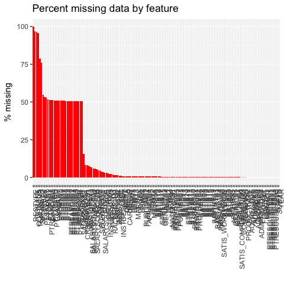

Faculty Classification
================
Chad Evans

Built with R version 3.3.2. Last run on 2017-08-31.

Contents
--------

-   [Configure](#configure)
    -   Directories
    -   Libraries
-   [Munge](#munge)
    -   Subset
    -   Missing Data
    -   Variables
    -   Imputation
    -   Data
-   [Cluster Analysis](#cluster-analysis)
    -   Determining the Number of Clusters
    -   K-means Clustering
-   Tabulations
    -   [Demography Table](#demography-table)
    -   [Institution Table](#institution-table)
    -   [Department Table](#departmental-table)
    -   [Employment Table](#employment-table)
-   [Conclusion](#conclusion)
-   [Appendix](#appendix)
    -   Gappa and Leslie (1993) classification
    -   Furstenberg (2015) classification

Configure
---------

Munge
-----

``` r
load(file.path(Private_Cache,"HERI_Class.RData"))
source(file.path(Munge, "01_Merge_the_data.R"))
source(file.path(Munge, "02_Clean_the_data.R"))
source(file.path(Munge, "HERI_vars.R"))
```

``` r
raw_n<-nrow(df)
df<-df %>% filter(!(TENURE=="Tenured")) # reduces from 8980 to 8450
filtered_n<-nrow(df)
```

The original 2010 HERI data had 8980 observations. After removing part-time faculty with Tenure (an anomoly outside the scope of this research), we have a total of 8450 faculty.

### Missing Data

``` r
miss_pct<-df %>%
  map_dbl(function(x) { round((sum(is.na(x)) / length(x)) * 100, 1) })
data.frame(miss=miss_pct, var=names(miss_pct), row.names=NULL) %>%
ggplot(aes(x=reorder(var, -miss), y=miss)) +
geom_bar(stat='identity', fill='red') +
labs(x='', y='% missing', title='Percent missing data by feature') +
theme(axis.text.x=element_text(angle=90, hjust=1))
```



The missingness in these data is less concerning than it appears. There are 31 variables missing more than 50 percent of their observations; however, this is because they are mostly only questions that pertain to part-time faculty. Full-time faculty did not respond to this battery of questions and so these questions will not play any role in the analysis. There are an additional 10 variables with 5-10 percent missingness. This is not ideal, but the level of missingness is pretty small. The vast majority of our variables (112 of them) have less than 5 percent missingness. These will be very useful in helping identify clusters of faculty with these characteristics. Despite this small amount of missingness, I still anticipate imputing data. With so many features, surely listwise deletion would lead to an unacceptable deletion of most of our data.

``` r
df<-df %>% select(one_of(c(ADMINVARS,WORKVARS,SALARYVARS,INSTVARS,BACKVARS,ATTITUDEVARS,OTHERVARS,PROFDEVVARS, FACTORVARS, PRODUCTIVITYVARS,STRESSVARS,SATISVARS,PTVARS)))
HIGHMISS<-labels(which(miss_pct>50))
OMIT<-c(ADMINVARS,PTVARS,HIGHMISS) 

df$SALARYALL=pmax(df$SALARY, df$PTSALARY, na.rm = TRUE) # important to include the combined salary variable so that salary insn't exclude from the clustering.
```

We will conduct k-means clustering using as many meaningful faculty features as possible. We remove the administrative variables like subject IDs and institution IDs that contribute no meaningful information. We also remove all variables corresponding only to part-time faculty and the handful of other characterstics with missingness greater than 50 percent. Our final data frame for k-means clustering consists of 8450 observations and 113 faculty features.

``` r
#Imputing takes 2-3 hours
tempData<-df %>% select(-one_of(OMIT)) %>% mice(m=1,maxit=50,seed=500) # originally used meth='pmm'
#save(tempData, file=file.path(Private_Cache,"tempData.RData"))
IData <- complete(tempData,1)
save(IData, file=file.path(Private_Cache,"IData.RData"))
```

As expected, listwise deletion across 117 features is impossible. In fact, there is not a single observation with complete data. We thus must consider a method to deal with the missingness. I opt for single imputiation. In some cases, like regression, it would probably be worth multiply imputing to get standard errors correct. However, this study is not using standard errors and is merely an experimental procedure to find coherence in the data. I thus opt to singly impute the data for reasons of simplicity.

I set the maximum iterations to 50, rather than the default of 5. This will give the chained equations more attempts to converge on a good imputed value for each cell. Predictive mean matching was used for numeric variables. Logistic regression was used to impute binary data. Polytomous regression imputation was used for unordered categorical variables.

Data
----

``` r
load(file.path(Private_Cache,"IDataOLD.RData")) # Singly imputed data
data<-IData
```

Cluster Analysis
----------------

``` r
data<-data.frame(model.matrix(~ ., data=data , contrasts.arg = lapply(data[,sapply(data, is.factor)], contrasts, contrasts=FALSE)))
```

To implement k-means clustering, all data must be numeric. This required converting binary factors to zero and ones. Multinomial variables needed to be converted into a matrix of dummy variables. Some claim that it is ineffective to convert categorical predictors into binaries in this fashion. But it is necessary if you want multinomial features to factor into the analysis. As this chapter is descriptive and exploratory, I implemented this traditional practice of creating a matrix of numeric variables.

### Determining the number of Clusters.

When implementing k-means clustering, one must specify the number of means to cluster around in the data. The most common approach to choosing the number of clusters is to plot how the within sum of squared residuals decreases as additional means are added and identify the "elbow." This is the point where explained variation begins its platau.

``` r
wssplot <- function(data, nc=15, seed=1234){
  wss <- (nrow(data)-1)*sum(apply(data,2,var))
  for (i in 2:nc){
    set.seed(seed)
    wss[i] <- sum(kmeans(data, centers=i)$withinss)
  }
  plot(1:nc, wss, type="b", xlab="Number of Clusters", ylab="Within groups sum of squares", main="Determining the Number of Clusters")
}
wssplot(data, nc=7) # put in # of clusters here
```


The elbow suggests that four clusters sufficiently explain most of the variation. I therefore opt to go witih four means in the k-means clustering analysis.

### K-Means Clustering

``` r
d<-data[,-1] # git rid of the intercept (no variation, convergence issues)
d<-scale(d)
kmeans.obj<- d %>% kmeans(4, nstart = 10, algorithm = c("Hartigan-Wong"))
df$cluster<-kmeans.obj$cluster
```

Before conducting k-means clustering, all variables were normalized so that features with the greatest ranges did not have undue influence on the formation of clusters.

To conduct the k-means analysis, it is important to choose random starting points for the means. This helps prevent the algorithm (Hartingan-Wong 1979) from converging on suboptimal means. I used 10 different sets of starting points to identify the means that best summarize the information in the data.

Tabulations
-----------

``` r
source(file.path(Munge, "03_Recode_HERI.R"))
```

``` r
clusters<-table(df$cluster)
print(clusters)
```

    ## 
    ##    1    2    3    4 
    ## 2244  950 2557 3229

``` r
C1<-paste("Cluster 1 (n=",clusters[1],")",sep = "")
C2<-paste("Cluster 2 (n=",clusters[2],")",sep = "")
C3<-paste("Cluster 3 (n=",clusters[3],")",sep = "")
C4<-paste("Cluster 4 (n=",clusters[4],")",sep = "")
Clusternames<-c(C1,C2,C3,C4)
```

### Demography Table

``` r
DemVars<-c("AGE","SEX","MARITAL2","RACEGROUP2","GENACT02","NATENGSP","NCHILD3","DEGEARN2","DEGWORK2")
table<-round(nfCrossTable(data=df[DemVars],CTvar=df$cluster),2)
colnames(table)<-Clusternames
rownames(table)<-c("Age","Male","Married","White","Citizen","Native English","Avg. Children","BA or Less","Prof Degree","Ph.D.","Working on a Degree")
kable(table, caption = "Distribution of Adjunct Clusters by Demographic Characteristics")
```

|                     |  Cluster 1 (n=2244)|  Cluster 2 (n=950)|  Cluster 3 (n=2557)|  Cluster 4 (n=3229)|
|---------------------|-------------------:|------------------:|-------------------:|-------------------:|
| Age                 |               47.37|              50.19|               52.14|               49.78|
| Male                |                0.41|               0.45|                0.51|                0.44|
| Married             |                0.75|               0.79|                0.80|                0.77|
| White               |                0.80|               0.84|                0.84|                0.85|
| Citizen             |                0.93|               0.94|                0.97|                0.95|
| Native English      |                0.88|               0.90|                0.93|                0.90|
| Avg. Children       |                1.34|               1.62|                1.84|                1.61|
| BA or Less          |                0.05|               0.06|                0.12|                0.06|
| Prof Degree         |                0.57|               0.56|                0.75|                0.58|
| Ph.D.               |                0.38|               0.38|                0.14|                0.36|
| Working on a Degree |                0.24|               0.13|                0.19|                0.20|

Generally, the different clusters of adjuncts do not differ substantialy with regard to demography. However, cluster 1 may tend to have fewer children, often no children. Cluster 3 tends to have a greater concentration of professional degrees, rather than ph.d.'s. Cluster 2 may be a bit more established in their education, as fewer of them are currently working on an additional degree.

### Institution Table

``` r
INSTVARS<-c("INSTTYPE","INSTCONT","CARNEGIE","BIGLAN","SELECTIVITY2","INSTDESCR03","INSTDESCR08","INSTOPN10","INSTOPN11")
table<-round(nfCrossTable(data=df[INSTVARS],CTvar=df$cluster),2)
colnames(table)<-Clusternames
rownames(table)<-c("2-year","4-year","University","Public","Research I","Research II","R3/Doctoral","Bachelors/Masters","Associates","Other Inst.","Hard/Applied","Hard/Pure","Soft/Applied","Soft/Pure","Other Biglan","Highly Selective","Faculty very respectful","Administators very considerate","Research valued","Teaching valued")
kable(table, caption = "Distribution of Adjunct Clusters by Institutional Characteristics")
```

|                                |  Cluster 1 (n=2244)|  Cluster 2 (n=950)|  Cluster 3 (n=2557)|  Cluster 4 (n=3229)|
|--------------------------------|-------------------:|------------------:|-------------------:|-------------------:|
| 2-year                         |                0.01|               0.00|                0.05|                0.01|
| 4-year                         |                0.67|               0.57|                0.69|                0.67|
| University                     |                0.32|               0.42|                0.26|                0.32|
| Public                         |                0.48|               0.34|                0.36|                0.38|
| Research I                     |                0.04|               0.07|                0.03|                0.05|
| Research II                    |                0.19|               0.26|                0.15|                0.18|
| R3/Doctoral                    |                0.07|               0.09|                0.06|                0.08|
| Bachelors/Masters              |                0.67|               0.56|                0.71|                0.68|
| Associates                     |                0.01|               0.00|                0.05|                0.01|
| Other Inst.                    |                0.01|               0.01|                0.00|                0.01|
| Hard/Applied                   |                0.27|               0.31|                0.39|                0.35|
| Hard/Pure                      |                0.03|               0.04|                0.01|                0.05|
| Soft/Applied                   |                0.13|               0.24|                0.23|                0.18|
| Soft/Pure                      |                0.50|               0.22|                0.30|                0.35|
| Other Biglan                   |                0.06|               0.19|                0.07|                0.07|
| Highly Selective               |                0.09|               0.13|                0.03|                0.14|
| Faculty very respectful        |                0.27|               0.45|                0.65|                0.65|
| Administators very considerate |                0.04|               0.27|                0.26|                0.28|
| Research valued                |                0.40|               0.70|                0.66|                0.81|
| Teaching valued                |                0.74|               0.86|                0.95|                0.98|

Cluster 2 tends to be found more often in research instiution. Other adjunct types more commonly work in liberal arts institutions issuing BAs and other lower-tier degrees.
Cluster 1 has a tendency to work in the soft science, pure fields (e.g. social sicences, languages, interdisciplinary studies, and philosophy). Cluster 2 is disproportionately found in "other" institutions, although it is unclear from HERI what might be included in that "other" category. Cluster 3 tend to work in non-selective institutions (moreso than other cluster categories). Cluster 1 tends to view other faculty members as less respectful (only a quarter of their collegues are viewed as very respectful). They also view administrators more harshly than the other clusters. Not surprisingly, they are less likely to say that their teaching and research are valued.

### Departmental Table

``` r
table<-round(prop.table(table(df$DEPTA, df$cluster),2),2) # DEPTA was aggregated by HERI
colnames(table)<-Clusternames
rownames(table)<-c("Agri/Forestry","Biology","Business","Education","Engineering","English","Fine Arts","Health-related","History/PoliSci","Humanities","Math/Stats","Non-technical","Technical","Physical Sciences","Social Sciences")
kable(table, caption = "Distribution of Adjunct Clusters by Departmental Characteristics")
```

|                   |  Cluster 1 (n=2244)|  Cluster 2 (n=950)|  Cluster 3 (n=2557)|  Cluster 4 (n=3229)|
|-------------------|-------------------:|------------------:|-------------------:|-------------------:|
| Agri/Forestry     |                0.01|               0.01|                0.00|                0.01|
| Biology           |                0.05|               0.04|                0.02|                0.04|
| Business          |                0.06|               0.06|                0.17|                0.08|
| Education         |                0.06|               0.12|                0.14|                0.11|
| Engineering       |                0.02|               0.02|                0.02|                0.02|
| English           |                0.13|               0.04|                0.06|                0.07|
| Fine Arts         |                0.13|               0.03|                0.07|                0.07|
| Health-related    |                0.07|               0.14|                0.07|                0.12|
| History/PoliSci   |                0.05|               0.01|                0.02|                0.03|
| Humanities        |                0.11|               0.05|                0.06|                0.08|
| Math/Stats        |                0.03|               0.01|                0.05|                0.06|
| Non-technical     |                0.14|               0.33|                0.15|                0.15|
| Technical         |                0.03|               0.02|                0.04|                0.03|
| Physical Sciences |                0.03|               0.04|                0.01|                0.05|
| Social Sciences   |                0.09|               0.08|                0.10|                0.09|

Now let's look at departments in particular. Cluster 3 have a greater tendency to work in business schools. Cluster 1, again, are more likely to work in English, Fine Arts, and the humanities, although their percentage in the social sciences looks comparative to the other clusters. They are also less likely to work in Education departments. Cluster 2 have a greater tendency of working in non-technical fields and also health-related fields (along with cluster 4).

### Employment Table

``` r
WORKVARS<-c("PRINACT2","FULLSTAT","ACADRANK","GENACT01","HEALTHBENEFITS", "RETIREBENEFITS","SALARYALL","COURSENUM","PROFDEVFAC")
table<-round(nfCrossTable(data=df[WORKVARS],CTvar=df$cluster),2)
colnames(table)<-Clusternames
rownames(table)<-c("Teaching","Research","Administration","Other","Full-time","Assistant Professor","Associate Professor","Instructor","Lecturer","Professor","Union member","Health benefits","Retirement","Avg. Salary","Avg. Courses","Prof. Dev. Rating")
kable(table, caption = "Distribution of Adjunct Clusters by Work Characteristics")
```

|                     |  Cluster 1 (n=2244)|  Cluster 2 (n=950)|  Cluster 3 (n=2557)|  Cluster 4 (n=3229)|
|---------------------|-------------------:|------------------:|-------------------:|-------------------:|
| Teaching            |                0.96|               0.15|                0.97|                0.96|
| Research            |                0.02|               0.13|                0.00|                0.01|
| Administration      |                0.01|               0.55|                0.00|                0.00|
| Other               |                0.02|               0.16|                0.02|                0.03|
| Full-time           |                0.50|               0.90|                0.03|                0.77|
| Assistant Professor |                0.20|               0.27|                0.06|                0.29|
| Associate Professor |                0.05|               0.18|                0.04|                0.09|
| Instructor          |                0.36|               0.27|                0.61|                0.25|
| Lecturer            |                0.35|               0.14|                0.21|                0.27|
| Professor           |                0.04|               0.14|                0.07|                0.08|
| Union member        |                0.25|               0.09|                0.15|                0.16|
| Health benefits     |                0.87|               0.96|                0.27|                0.92|
| Retirement          |                0.86|               0.97|                0.31|                0.93|
| Avg. Salary         |            35363.96|           73436.25|            11485.56|            50186.92|
| Avg. Courses        |                3.20|               1.09|                1.86|                3.04|
| Prof. Dev. Rating   |               -0.06|               0.35|               -0.37|                0.23|

Cluster 2, it is clear, tend to be administrators. The other clusters tend to be teachers. Most of cluster 2 works full-time. In contrast, almost all cluster 3 adjuncts work part-time. Cluster 3 adjuncts also only rarely hold a distinguished academic rank. Instead they tend to be classified as lecturers and instructors. Cluster 1 are more likely to be unionized and they also tend to more often have health and retirement benefits. The cluster 2 administrative adjuncts and cluster 4 adjuncts regularly have such benefits, but they are rarely union positions.

Cluster 3, the group with so many part-time faculty, tend to earn the lowest salaries. They also get the least amount of professional development. Cluster 1, which appear to be something of an aspiring adjunct, earn modest salaries and tend to teach the most courses. Clusters 2 and 4 tend to earn the highest salaries and they also tend to get professional development. But whereas cluster 2 tend to be administrators, cluster 4 are teachers averaging 3 classes a term.

Conclusion
----------

The employment characteristics tend to offer the most coherent understanding of who these adjuncts are and what they are doing in academia. The dimensions of full-time status, administration/teaching status and compensatory variables tend to most clearly distinguish adjunct times. One might conclude that cluster 1 constitutes the "aspiring academic of the soft sciences" Cluster two is probably an "administrative adjunct." Cluster 3 is probably the "part-time adjunct." Adjunct 4 is the "aspiring academic of the hard and applied fields."

Appendix
--------

As demonstrated earlier, non-tenure track faculty are heterogeneous in their composition. Some are young academics trying to begin their careers in academia. Some are retiring faculty who are interested in leaving their life's work in a gradual fashion. We explored the motives for working part-time in academia and indeed it was a useful way to characterize and classify non-tenure track faculty. We also explored two other classification schema in our research. The first was designed by Gappa and Leslie and featured in their 1993 book "The Invisible Faculty." Gappa and Leslie were some of the earlist scholars to identify and seek knowledge about the growing numbers of part-time faculty in higher education. Examining faculty at 18 colleges and universities, they focused on the features of career-enders; experts; freelancers; and aspiring academics. Career enders consisted of faculty who were in the process of retiring from the workforce. Many of these individuals were not career academics, but instead had worked in the private sector. Part-time faculty in this class worked for supplemental income or simply because they enjoyed teaching. Experts (specialists or professionals) were hired for their specialized knowledge or experience. Freelancers were mostly faculty who wanted to supplement the income earned from a career outside of academia. These faculty were also commonly homemakers, taking care of children and domestic chores on the side.

A final category identified by these authors were the aspiring academics. Aspiring academics are “relatively new Ph.D.’s seeking tenure-track appointments and some Ph.D. recipients who have been teaching on a part-time basis for years in the hope of attaining a full-time, tenure-track position. Under better circumstances, they would be part of the tenured faculty (1993, p.54.55).” This definition calls attention to an important dimension often excluded by many researchers. Rather than generalize across all adjuncts, Gappa and Leslie make the point of distinguishing between those who are trying to establish a full-time, long-term career in academia and those who simply dabble in it. Recognizing the voluntary/involuntary nature of contingent status, then, is integral for any typological schema. This is a point also stressed by other researchers (Tilly 1998, Maynard and Joseph 2008).

While the IPEDS and SDR datasets were very useful in understanding the growth of non-tenure track faculty over the decades, they each possess limitations. For the follow section, we draw on the HERI Faculty Survey. HERI is a cross-sectional instrument generalizing to all postsecondary instructional faculty. We draw specifically on their component related to non-tenure track faculty. The information on these faculty, particularly the part-time, non-tenure track faculty, is far more detailed than IPEDS or SDR. In the following figure (Figure 27), we take advantage of this detail by reproducing the classifcation schema formalized by Leslie and Gappa (1993).

``` r
ggplot(data=subset(df, !is.na(GAPPANTT)), aes(x=GAPPANTT)) + geom_bar(fill="firebrick") + xlab("Adjunct Type") + ylab("Count") +
labs(title="Gappa and Leslie Classification of Adjunct Faculty (1993)", subtitle= "Schema Applied to HERI Faculty Survey 2010") +
labs(caption = "Evans & Furstenberg. HERI Faculty Survey 2010") + theme(axis.text=element_text(size=10), axis.title=element_text(size=10), legend.text=element_text(size=10), legend.title=element_text(size=10))
```


As shown above, half of the data we were supplied by HERI pertain to full-time, non-tenure track faculty. Aspiring academics are the largest subgroup of part-time faculty. In fact, there are more part-time aspiring academics in the sample than all other part-time adjuncts put together. Experts and freelancers each constitute about 10% of the non-tenure track population. Career-enders constitute a small minority of 4%.

Dr. Furstenberg developed a second classification system that splits adjuncts into four categories, rather than five. In his framework, adjunct classification takes on two dimensions: whether the faculty member worked full-time or part-time, and whether the adjunct held work in addition to his or her adjunct position. Professional adjuncts were part-time faculty who held full-time careers outside of education. Itinerants were faculty members teaching piecemeal at two or more institutions. Some have referred to these individuals as "freedom flyers" as they tend to spend a considerable amount of time commuting between jobs. Single institution adjuncts, however, only hold one part-time position and no other career (inside or outside of academia). They are therefore employed by a single institution. His last category is the full-time, non-tenure track group of faculty members. When applying Furstenberg's schema, it divides the sample of part-time faculty members into equitably sized groups, each containing between 13% and 19% of the sample.

``` r
ggplot(data=subset(df, !is.na(ADJUNCT1)), aes(x=ADJUNCT1)) + geom_bar(fill="steelblue4") + xlab("Adjunct Type") + ylab("Count") +
labs(title="Furstenberg Classification of Adjunct Faculty (2015)") +
labs(caption = "Evans & Furstenberg. HERI Faculty Survey 2010") + theme(axis.text=element_text(size=10), axis.title=element_text(size=10), legend.text=element_text(size=10), legend.title=element_text(size=10))
```


Now we turn our attention to how adjunct classification compares across demographics, employment conditions and job activities. We rely on the Gappa and Leslie categorization here due to its prevalence in the literature. HERI allowed us to distinguish all five categories of adjuncts, derived from questions related to full-time/part-time status, (in)voluntary status, outside career status and whether retirement is imminent (with three years).

### Demographic Characteristics of Gappa Classification

``` r
GAPPAnames<-c("Full-time","Aspiring Academic","Career-Ender","Expert","Freelancer")
DemVars<-c("AGE","SEX","MARITAL2","RACEGROUP2","GENACT02","NATENGSP","NCHILD3","DEGEARN2","DEGWORK2")
table<-round(as.data.frame(nfCrossTable(data=df[DemVars],CTvar=as.integer(df$GAPPANTT))),2)
colnames(table)<-GAPPAnames
rownames(table)<-c("Age","Male","Married","White","Citizen","Native English","Avg. Children","BA or Less","Prof Degree","Ph.D.","Working on a Degree")
kable(table, caption = "Distribution of Adjunct Clusters by Demographic Characteristics")
```

|                     |  Full-time|  Aspiring Academic|  Career-Ender|  Expert|  Freelancer|
|---------------------|----------:|------------------:|-------------:|-------:|-----------:|
| Age                 |      48.59|              48.47|         65.64|   52.64|       52.36|
| Male                |       0.44|               0.47|          0.52|    0.60|        0.34|
| Married             |       0.77|               0.75|          0.80|    0.84|        0.83|
| White               |       0.84|               0.79|          0.92|    0.87|        0.90|
| Citizen             |       0.94|               0.95|          1.00|    0.97|        0.96|
| Native English      |       0.89|               0.89|          0.95|    0.96|        0.93|
| Avg. Children       |       1.50|               1.60|          2.07|    1.87|        1.79|
| BA or Less          |       0.05|               0.08|          0.05|    0.16|        0.08|
| Prof Degree         |       0.58|               0.69|          0.53|    0.70|        0.65|
| Ph.D.               |       0.37|               0.23|          0.42|    0.14|        0.28|
| Working on a Degree |       0.19|               0.27|          0.07|    0.13|        0.13|

In terms of demographic characteristics, full-time non-tenure track faculty tend to be married with children. Three-quarters are married and two-thirds of them have at least one child. They come from various segments of the age distribution, with sizeable numbers (39%) mid-career (age 40-55) and are evenly split between men and women. Half tend to have earned a Ph.D. and half are at the Master's level. There are also a few (5%) who have only earned a bachelor's (or lower).

Aspiring academics tend to closely resemble full-time, non-tenure track faculty. The only difference is that aspiring academics have been unable to obtain a full-time position in academia. Aspiring academics also are slightly less likely to have earned a Ph.D., which is probably closely related to why they have been unable to find full-time work in a single institution.

Career-enders are predictably older, with 96% of them 55 or older. They are overwelmingly white, which is an artifact of the time period when many of them were hired. However, the gender composition is evenly split. They also are more likely to have children, which again is related to the fact that they are older and have had more time to begin families. Aside from these features, career-enders are otherwise very similar to full-time adjuncts and aspiring academics.

Experts in academia tend to be white men (60% are men). They also tend to be older and are less likely to have earned a Ph.D.. Many of these characteristics make sense for an expert. They are older, having spent many years outside of academia gaining practical experience valuable to students. They are hired for this expertise, not for their educational credentials, per se.

Finally, freelancers are very similar to experts on most demographic characteristics. The one important exception is related to gender. Freelancers are much more likely to be female. Perhaps women pursue freelancing academic careers in order to be more available to their families. However, our analysis finds that freelancers are no more likely to have children than experts. Nonetheless, traditional gender roles likely have a role in determining why women become freelancers and men become adjunct experts.

### Institutional Characteristics of Gappa Classification

``` r
INSTVARS<-c("INSTTYPE","INSTCONT","CARNEGIE","BIGLAN","SELECTIVITY2","INSTDESCR03","INSTDESCR08","INSTOPN10","INSTOPN11")
table<-round(nfCrossTable(data=df[INSTVARS],CTvar=as.integer(df$GAPPANTT)),2)
colnames(table)<-GAPPAnames
rownames(table)<-c("2-year","4-year","University","Public","Research I","Research II","R3/Doctoral","Bachelors/Masters","Associates","Other Inst.","Hard/Applied","Hard/Pure","Soft/Applied","Soft/Pure","Other Biglan","Highly Selective","Faculty very respectful","Administators very considerate","Research valued","Teaching valued")
kable(table, caption = "Distribution of Adjunct Clusters by Institutional Characteristics")
```

|                                |  Full-time|  Aspiring Academic|  Career-Ender|  Expert|  Freelancer|
|--------------------------------|----------:|------------------:|-------------:|-------:|-----------:|
| 2-year                         |       0.00|               0.04|          0.05|    0.04|        0.05|
| 4-year                         |       0.64|               0.69|          0.70|    0.68|        0.70|
| University                     |       0.36|               0.26|          0.24|    0.28|        0.26|
| Public                         |       0.38|               0.44|          0.44|    0.33|        0.40|
| Research I                     |       0.05|               0.04|          0.06|    0.04|        0.04|
| Research II                    |       0.21|               0.14|          0.10|    0.19|        0.14|
| R3/Doctoral                    |       0.09|               0.06|          0.06|    0.04|        0.06|
| Bachelors/Masters              |       0.64|               0.71|          0.72|    0.69|        0.71|
| Associates                     |       0.00|               0.04|          0.05|    0.04|        0.04|
| Other Inst.                    |       0.01|               0.00|          0.00|    0.00|        0.00|
| Hard/Applied                   |       0.35|               0.31|          0.26|    0.47|        0.28|
| Hard/Pure                      |       0.04|               0.02|          0.03|    0.02|        0.04|
| Soft/Applied                   |       0.19|               0.18|          0.23|    0.18|        0.22|
| Soft/Pure                      |       0.33|               0.43|          0.41|    0.25|        0.40|
| Other Biglan                   |       0.09|               0.07|          0.07|    0.08|        0.06|
| Highly Selective               |       0.14|               0.05|          0.09|    0.04|        0.07|
| Faculty very respectful        |       0.51|               0.55|          0.61|    0.58|        0.53|
| Administators very considerate |       0.22|               0.20|          0.23|    0.22|        0.23|
| Research valued                |       0.68|               0.61|          0.64|    0.64|        0.65|
| Teaching valued                |       0.89|               0.89|          0.94|    0.90|        0.91|

There are also differences in the actual work activities of adjuncts. While all adjuncts in the HERI sample are instructors in some capacity, full-time adjuncts are more likely than the other classes of adjuncts to have principle job responsibilities in other areas like administration and research. Full-time adjuncts are hired in all academic fields (Biglan classification), however, they are less likely to be found in the hard/pure sciences. They do work regularly in the hard/applied fields, however, like medicine and nursing. Nearly all full-time adjuncts have professional development opportunities available to them and, furthermore, the majority partipate in professional development on a regular basis. This behavior ties in to what we know about full-time employees. Employers make a greater effort to develop the staff they see as full-time and fully committed. Full-time adjuncts tend to have considerable teaching obligations. They teach nearly three courses on average and also tend to have larger classes than other adjunct types.

Regarding aspiring adjuncts, their principle activity in the vast majority of cases is teaching. Aspiring academics are found in all Biglan academic fields (although rarely in hard/pure sciences). Professional development is less likely part of an aspiring academic's work experiences. Many (20%) do not have opportunities for professional development and only a third ever participate in workplace trainings. Their teaching load resembles that of full-time adjuncts, despite the fact that they only work part-time. This high teaching load, no doubt, is part of the reason aspiring academics have difficulty securing full-time work. They teach almost as much as their full-time, non-tenure track collegues, often hold outside careers, and must prepare applications and interview for work. This is a sizeable amount of responsibly for someone only working part-time in academia.

Career-enders also tend to be teachers, although some have principle responsibilities in administration. Professional development opportunities tend to be available for career-enders and a small majority of this group of adjuncts actually takes part in training opportunities. Among part-time adjunct types, career-enders are the most likely to participate in professional development, perhaps because they are accomstomed to these kinds of trainings from the earlier part of their careers. Career-enders teach fewer classes on average (1.8 classes).

Similar to aspiring academics, the principle job activity of experts is to teach. Their teaching, however, tends to mainly be in the hard/applied sciences. So clinical faculty and those working in medicine are often adjunct experts. Professional development is widely available for experts, but they are less likely to actually participate in these trainings. This may be related to the fact that they are "experts" and additional training may not be useful or valuable to them. Experts teach 1.5 classes on average, with slightly smaller class sizes. This may be related to the applied nature of some of the courses they teach. There may be more hands-on activities requiring smaller class sizes for these adjuncts.

Freelancers resemble aspiring academics with regared to work activities, without quite as demanding of circumstances. The majority of them have principle teaching activities and they teach in the same fields as aspriring adjuncts. Professional development is generally avaialble and many are participants in these trainings. At 2.2 courses, their workload is slightly lighter than that of aspiring academics.

### Academic Departments of Gappa Classification

``` r
table<-round(prop.table(table(df$DEPTA, df$GAPPANTT),2),2) # DEPTA was aggregated by HERI
colnames(table)<-GAPPAnames
rownames(table)<-c("Agri/Forestry","Biology","Business","Education","Engineering","English","Fine Arts","Health-related","History/PoliSci","Humanities","Math/Stats","Non-technical","Technical","Physical Sciences","Social Sciences")
kable(table, caption = "Distribution of Adjunct Clusters by Departmental Characteristics")
```

|                   |  Full-time|  Aspiring Academic|  Career-Ender|  Expert|  Freelancer|
|-------------------|----------:|------------------:|-------------:|-------:|-----------:|
| Agri/Forestry     |       0.01|               0.00|          0.00|    0.00|        0.00|
| Biology           |       0.05|               0.03|          0.03|    0.02|        0.05|
| Business          |       0.08|               0.13|          0.06|    0.21|        0.06|
| Education         |       0.10|               0.10|          0.18|    0.08|        0.17|
| Engineering       |       0.02|               0.02|          0.02|    0.03|        0.01|
| English           |       0.07|               0.09|          0.12|    0.03|        0.13|
| Fine Arts         |       0.06|               0.12|          0.06|    0.08|        0.07|
| Health-related    |       0.12|               0.05|          0.06|    0.12|        0.07|
| History/PoliSci   |       0.02|               0.04|          0.07|    0.01|        0.04|
| Humanities        |       0.09|               0.08|          0.06|    0.04|        0.07|
| Math/Stats        |       0.05|               0.04|          0.07|    0.03|        0.07|
| Non-technical     |       0.19|               0.15|          0.11|    0.17|        0.11|
| Technical         |       0.03|               0.03|          0.02|    0.05|        0.02|
| Physical Sciences |       0.04|               0.02|          0.03|    0.02|        0.04|
| Social Sciences   |       0.08|               0.12|          0.10|    0.11|        0.08|

### Employment Conditions of Gappa Classification

``` r
WORKVARS<-c("PRINACT2","FULLSTAT","ACADRANK","GENACT01","HEALTHBENEFITS", "RETIREBENEFITS","SALARYALL","COURSENUM","PROFDEVFAC")
table<-round(nfCrossTable(data=df[WORKVARS],CTvar=as.integer(df$GAPPANTT)),2)
colnames(table)<-GAPPAnames
rownames(table)<-c("Teaching","Research","Administration","Other","Full-time","Assistant Professor","Associate Professor","Instructor","Lecturer","Professor","Union member","Health benefits","Retirement","Avg. Salary","Avg. Courses","Prof. Dev. Rating")
kable(table, caption = "Distribution of Adjunct Clusters by Work Characteristics")
```

|                     |  Full-time|  Aspiring Academic|  Career-Ender|    Expert|  Freelancer|
|---------------------|----------:|------------------:|-------------:|---------:|-----------:|
| Teaching            |       0.80|               0.97|          0.92|      0.98|        0.93|
| Research            |       0.04|               0.01|          0.02|      0.01|        0.01|
| Administration      |       0.11|               0.01|          0.04|      0.00|        0.02|
| Other               |       0.05|               0.01|          0.02|      0.02|        0.04|
| Full-time           |       1.00|               0.00|          0.00|      0.00|        0.00|
| Assistant Professor |       0.32|               0.08|          0.05|      0.07|        0.10|
| Associate Professor |       0.11|               0.04|          0.06|      0.05|        0.07|
| Instructor          |       0.27|               0.51|          0.31|      0.59|        0.47|
| Lecturer            |       0.25|               0.32|          0.21|      0.23|        0.24|
| Professor           |       0.06|               0.06|          0.37|      0.06|        0.13|
| Union member        |       0.13|               0.23|          0.25|      0.10|        0.26|
| Health benefits     |       0.95|               0.54|          0.59|      0.31|        0.52|
| Retirement          |       0.94|               0.56|          0.65|      0.34|        0.59|
| Avg. Salary         |   59270.56|           15868.56|      23485.43|  10302.64|    18674.39|
| Avg. Courses        |       2.80|               2.59|          1.85|      1.50|        2.21|
| Prof. Dev. Rating   |       0.23|              -0.27|          0.10|     -0.38|       -0.11|

In terms of employment conditions, different types of adjunct face different types of conditions. As one would expect, full-time, non-tenure track faculty tend to have little or no work outside of their principle job. This makes sense, as they are already dedicating 35 hours or more to their principle job. As they are full-time workers, they also tend to have much stronger institutional support in terms of salary and perquisites. They earn good salaries (60,000/yr) and the vast majority have health insurance and retirement contributions. Perhaps because of this support, few of them have organized as members of labor unions.

Nearly half of aspriring academics have some or a lot of work outside of their principle academic position. Many of these aspiring academics, no doubt, are the itinerants or freeway fliers trying to piece together a career and work towards a full-time position. Half of them receive retirment benefits and half have employer contributions to their healthcare. Only a quarter have union membership. Their institutional salary is low ($16,000), which is probably why so many of them have second or even third jobs. Their family income is more robust ($70,000), suggesting that these individuals may have spouses taking on considerable responsibilities for family finances.

Career-enders tend to have similar job conditions as aspiring academics, only they are less likely to have jobs outside of their academic appointment. Their salary also tends to be higher, perhaps because they are older, have more job connections and more experience. They are also more likely to have health and retirement benefits. Maintaining health and retirement benefits is probably an important part of why career-enders like to stay active in academia before completely retiring. In all other ways, their work conditions seem closely related to what aspiring academics expereince.

Three-quarters of experts work substantial hours outside of their academic appointment. They are also less likely to have healthcare contributions, retirement benefits and union representation. Perhaps many of them already have health and retirement benefits from outside careers. Their institutional salary is also pretty low, but their overall income is by far the highest of all adjunct types. This all conforms with our expectations regarding experts. These individuals do not participate in academia for financial reasons. They probably do it simply because they like sharing their work experience with young people, being exposed to a stimulating, intellectual environment or they need a productive break from their full-time careers.

Finally, Freelancers are nearly identical to aspiring academics, except that they are much less likely to have substantial work outside of their principle academic appointment. Freelancers teach part-time proabably because they enjoy teaching, but do not necessarily want to do it full-time. A part-time job probably gives them great flexibility to meet family demands or other responsibilities.
